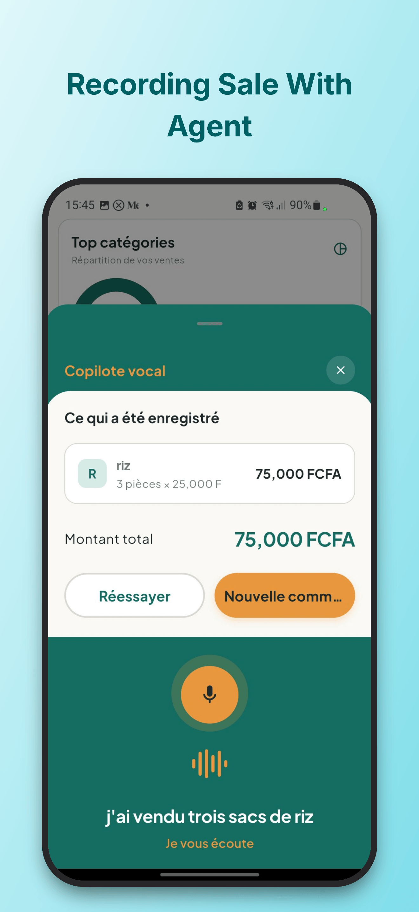
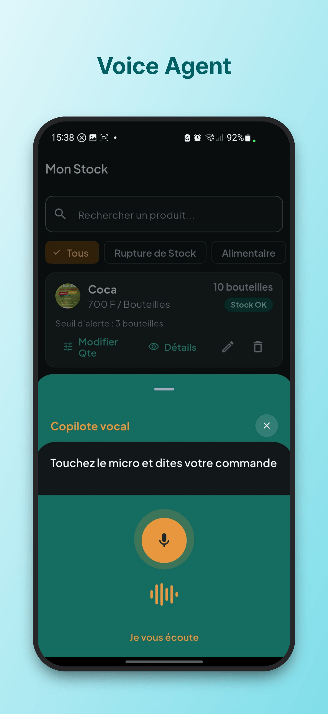
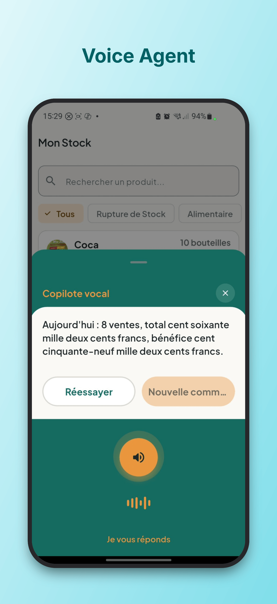
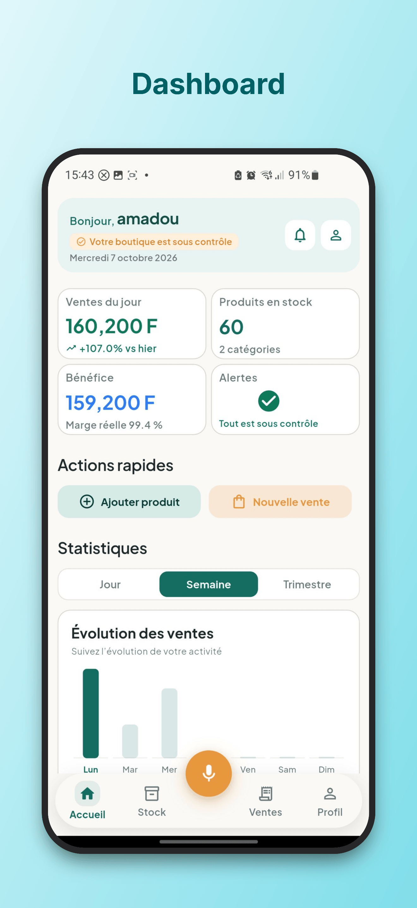
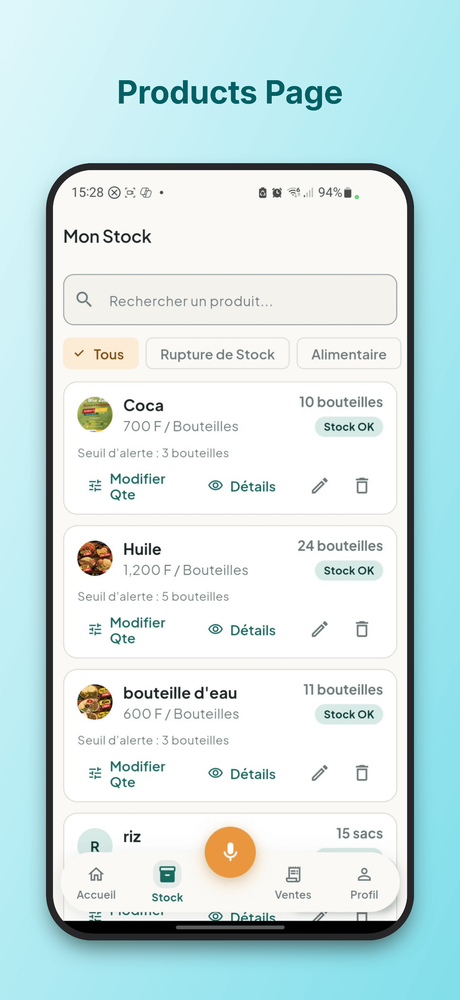
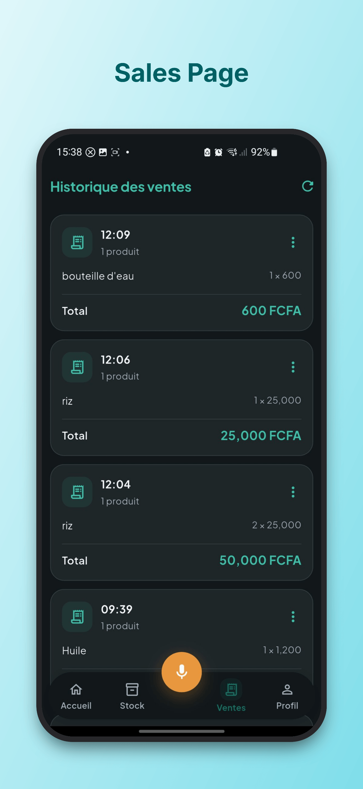
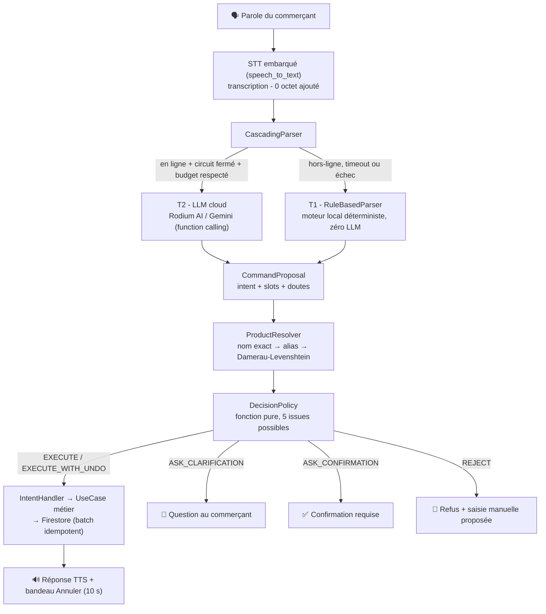

<div align="center">


# KioskMind

**La caisse qui vous écoute - même sans réseau.**

Application de gestion de boutique (ventes, stock, alertes, prédictions) pilotée à la voix,
conçue pour les acteurs du secteur informel africain.

*Hands full. Network down. KioskMind still works.*

[](https://flutter.dev)
[](https://dart.dev)
[](#architecture)
[](#hors-ligne--sans-llm-local)
[](#qualité--mesurée-pas-déclarée)

</div>

---

## Le problème

Un commerçant de kiosk a **les deux mains prises** : une sur le carnet, une sur la marchandise.
Il veut dire *« vendu deux sucre et un lait »* et que la vente soit enregistrée.

Et dans le secteur informel, deux réalités sont non négociables :

1. **Le réseau tombe tout le temps.** Pas de 4G stable, pas de Wi-Fi fiable.
2. **Aucune place pour une saisie clavier** : l'écran se manipule pendant les pauses, ou pas du tout.

Les outils numériques existants supposent les deux : un doigt disponible et Internet permanent.
Ce sont exactement les deux choses qu'un kiosk n'a jamais.

## La solution

**KioskMind** rend les outils de gestion accessibles **par la voix**.

L'utilisateur parle en langage naturel ; la parole est convertie en texte (*Speech-to-Text*),
une intention en est extraite, et l'application exécute l'action métier correspondante -
vente, approvisionnement, consultation de stock, annulation, statistiques, export.

> **La voix est un canal d'entrée, pas un produit à part.**
> Une commande vocale appelle exactement le même cas d'usage qu'un bouton :
> mêmes règles, mêmes écritures, mêmes garanties.

Et surtout :

> **Tout fonctionne hors connexion.** Pas de LLM local à télécharger, pas de modèle de 75 Mo,
> pas d'attente. Un moteur déterministe embarqué prend le relais dès que le cloud est absent -
> et personne ne voit la différence, sauf que **ça répond**.

---

## Démonstration

<table>
  <tr>
    <td width="33%" align="center">
      <br>
      <b>Vente à la voix</b><br><i>« vendu deux sucre et un lait »</i>
    </td>
    <td width="33%" align="center">
      <br>
      <b>Assistant vocal</b><br>Transcription, actions, annulation
    </td>
    <td width="33%" align="center">
      <br>
      <b>Stats du jour</b><br>Posées à la voix, chiffrées à l'écran
    </td>
  </tr>
  <tr>
    <td width="33%" align="center">
      <br>
      <b>Tableau de bord</b>
    </td>
    <td width="33%" align="center">
      <br>
      <b>Produits & stock</b>
    </td>
    <td width="33%" align="center">
      <br>
      <b>Historique des ventes</b>
    </td>
  </tr>
</table>

### Le scénario en 60 secondes

1. **Mode avion activé.**
2. Voix : *« vendu deux sucre et un lait »* → récapitulatif affiché **et parlé**, bouton **Annuler** visible.
3. Voix : *« annule »* → vente annulée, stock restitué, stats corrigées.
4. Voix : *« combien il reste de riz »* → réponse parlée avec le stock réel.
5. Voix ambiguë : *« vendu de l'huile »* → l'assistant **pose la question** au lieu de deviner.
6. **Réseau rétabli** → phrase libre multi-articles, interprétée par le LLM cloud.
7. **Coupure réseau en pleine commande** → bascule automatique sur le moteur local, **aucune commande perdue**.

---

## Le mode vocal : comment il est construit

### Pipeline complet



Deux parseurs, **un seul objet de sortie** (`CommandProposal`) : à partir de là,
le trajet est identique en ligne et hors ligne. C'est ce qui garantit qu'un comportement
testé hors ligne se reproduit à l'identique en ligne.

### Ligne du temps d'une commande vocale

| Étape | Composant | Ce qu'il garantit |
|---|---|---|
| 1. Écoute | `speech_to_text` (service système) | STT **embarqué**, 0 octet ajouté à l'app - ADR-001 |
| 2. Transcription | un seul STT pour T1 et T2 | le même texte alimente les deux parseurs |
| 3. Interprétation | `CascadingParser` + `CircuitBreaker` | budget de temps strict, repli immédiat sur T1 en cas de timeout/échec |
| 4. Résolution produit | `ProductResolver` | **aucun identifiant inventé** : nom exact, alias, similarité |
| 5. Décision | `DecisionPolicy` (fonction pure) | 5 issues : exécuter / exécuter+annuler / question / confirmation / refus |
| 6. Exécution | `IntentHandler` → use case | la voix **n'écrit jamais dans Firestore** elle-même |
| 7. Retour | TTS + bandeau Annuler | confirmation parlée, fenêtre d'annulation de 10 s |

### Le catalogue d'intents : une seule source de vérité

Toutes les commandes sont déclarées dans [`voice/intent_catalog.json`](voice/intent_catalog.json) -
**14 intents**, alimentant à la fois le parseur local (T1, déclencheurs et exemples) et le LLM
cloud (T2, tools générés automatiquement). Ajouter une commande = **une entrée de catalogue + un handler**.

| | Intent | Exemple prononcé | Risque |
|---|---|---|---|
| 💰 | `record_sale` | *« vendu trois sachets de Maggi à cent francs »* | écriture réversible |
| 📦 | `record_restock` | *« reçu dix cartons de lait »* | écriture réversible |
| 🔍 | `query_stock` | *« combien il reste de riz »* | lecture |
| ↩️ | `cancel_last_sale` | *« annule la dernière vente »* | écriture réversible |
| 📊 | `query_daily_stats` | *« combien on a vendu aujourd'hui »* | lecture |
| ⚠️ | `query_low_stock` | *« qu'est-ce qui est presque épuisé »* | lecture |
| 💲 | `query_product_price` | *« à combien le sucre »* | lecture |
| 📉 | `record_stock_out` | *« deux riz cassés »* | écriture réversible |
| ➕ | `create_product` | *« j'ai un nouveau produit, le lait à 500 »* | écriture sensible |
| 💲 | `update_product_price` | *« mets le sucre à 700 »* | écriture sensible |
| 🕘 | `query_sales_history` | *« qu'est-ce qu'on a vendu mardi »* | lecture |
| 📄 | `export_sales_report` | *« exporte le rapport des ventes »* | lecture |
| 🧭 | `navigate_to_page` | *« va aux alertes »* | lecture (navigation) |
| 🏪 | `query_business_info` | *« comment s'appelle ma boutique »* | lecture |

Classes de risque : `READ`, `WRITE_REVERSIBLE`, `WRITE_SENSITIVE`.
**Aucune action destructive n'est exposée à la voix.**

---

## Hors ligne : sans LLM local

C'est la décision d'architecture centrale de KioskMind, et elle est délibérée.

### Pourquoi pas de LLM embarqué ?

| Option | Poids / coût | Verdict |
|---|---|---|
| LLM embarqué (Whisper, Llama, Mistral...) | **~75 Mo à plusieurs Go** de modèle, RAM et batterie sur un téléphone d'entrée de gamme, latence de génération | ❌ Écarté |
| Cloud uniquement | zéro poids, mais **l'app meurt quand le réseau tombe** | ❌ Inacceptable pour la cible |
| **Moteur déterministe embarqué** | **~0 Mo**, réponse instantanée, testable à 100 % | ✅ **Retenu** |

À la place d'un modèle statistique, KioskMind embarque un **moteur de compréhension
règles** qui couvre les commandes essentielles :

- **Normalisation du texte** (`TextNormalizer`) : casse, accents, ponctuation, abréviations.
- **Parseur de nombres français** (`FrenchNumberParser`) : *« vingt-cinq »* → `25`,
  *« deux cents »* → `200`, décimaux et milliers compris. **Recoupé** avec ce que dit le LLM
  quand il est présent : désaccord = doute, jamais une exécution aveugle.
- **Classification d'intention** (`IntentDetector`) : appariement sur le catalogue de déclencheurs.
- **Extraction de slots** : quantités, unités, prix, liste multi-articles dans l'ordre prononcé.
- **Résolution produit par distance d'édition** : **Damerau-Levenshtein**
  (`word_similarity.dart`) - *« magné »* ou *« magi »* trouvent *« Maggi »*
  dans le catalogue du commerçant, avec alias générés automatiquement.

**Résultat :** le commerçant ne télécharge rien, ne configure rien, et l'assistant répond
en **moins d'une seconde**, batterie comprise. Les commandes courantes marchent dans le métro,
au marché, en pleine coupure.

### Trois piliers offline complémentaires

| Pilier | Implémentation | Effet |
|---|---|---|
| **Compréhension locale** | `RuleBasedParser` (T1) | Les 14 intents fonctionnent sans réseau |
| **Catalogue local** | Snapshot produits dans `SharedPreferences` (`catalog_snapshot_store.dart`) | L'assistant connaît les vrais produits du commerçant sans interroger Firestore |
| **Écriture offline** | Persistance Firestore activée + `WriteBatch` avec `FieldValue.increment()` (jamais de transaction - elles échouent hors ligne) + identifiants générés côté client | Les ventes prises hors ligne **se synchronisent seules** au retour du réseau, **sans doublon** |

L'idempotence est traitée au niveau commande : chaque commande vocale porte un `commandId`
qui sert d'identifiant du document Firestore. Un rejeu après timeout réécrit le même document -
**jamais de vente comptée deux fois, jamais de stock décrémenté deux fois**.

---

## Sécurité : le LLM propose, l'application dispose

Un assistant qui écrit dans une base de données est un risque. KioskMind traite le LLM
comme un **interprète, jamais comme un exécuteur** :

- **D1 - Le LLM n'écrit jamais.** Il produit une *intention* ; le moteur métier exécute
  le use case correspondant, avec les mêmes garde-fous qu'un clic.
- **Aucun identifiant inventé.** Les produits sont résolus par l'application contre le
  catalogue réel ; un nom que rien ne correspond → **question au commerçant**, pas une ligne fantôme.
- **Politique de décision à 5 issues** (`DecisionPolicy`, fonction pure - mêmes entrées,
  même verdict, testée exhaustivement) :

| Issue | Déclenchée quand |
|---|---|
| `EXECUTE` | Lecture seule |
| `EXECUTE_WITH_UNDO` | Écriture claire, confiance élevée → exécution + **fenêtre d'annulation 10 s** |
| `ASK_CLARIFICATION` | Produit ambigu, quantité manquante, anaphore (*« combien il reste »* - de quoi ?) |
| `ASK_CONFIRMATION` | Prix différent du catalogue, quantité hors norme (>×5), désaccord LLM / parseur de nombres |
| `REJECT` | Phrase hors domaine ou incompréhensible → refus explicite + **saisie manuelle proposée** |

- **Aucune exécution erronée silencieuse** : tout doute devient une question ou une
  confirmation ; toute exécution est annulable ; tout refus est annoncé.
- **Annulation atomique** : annuler une vente restaure le stock ligne par ligne,
  corrige les statistiques du jour et marque la vente `CANCELLED` dans un **unique `WriteBatch`**.
  Rien n'est jamais supprimé.

---

## La cascade en ligne (mode online)

Quand le réseau est disponible, un **LLM cloud** prend le relais pour le langage libre -
vocabulaire informel, formulations inversées, phrases jamais vues :

```
CascadingParser
 ├─ Circuit fermé + budget de temps OK  →  T2 : LLM cloud (function calling)
 │    ├─ succès            → proposition enrichie, circuit enregistré
 │    └─ timeout / erreur  → repli immédiat sur T1, sur le MÊME texte
 └─ Circuit ouvert (échecs répétés)     →  T1 directement
```

- **Passerelles cloud supportées** : [Rodium AI](https://api.rodiumai.io) (gateway,
  modèle `google/gemini-2.5-flash`), **Google Gemini** en appel direct, ou une
  **Cloud Function** Firebase - choisies à la composition root selon les clés présentes.
- **`CircuitBreaker`** : au bout d'échecs conséquents, le cloud n'est même plus tenté ;
  le moteur local répond. Le réseau revient → le circuit se réarme tout seul.
- **Budget de temps strict** (~4,5 s) : dépassé, bascule locale. *Une commande n'attend
  jamais un serveur.*
- **Journal de route** (`ParseOutcomeJournal`) : chaque réponse enregistre le chemin pris
  (cloud, local, secours). Un commerçant sans clé, un commerçant sans réseau et un
  commerçant dont le modèle est lent **ne sont jamais confondus** - c'est ce qui rend
  le système diagnostique et ses métriques honnêtes.

> Sans clé ou avec `VOICE_ENABLE_CLOUD=false`, l'app construit un `LocalOnlyParser`
> qui répond pareil **et enregistre la raison**. Silencieusement répondre depuis les règles
> en prétendant être le modèle est le seul scénario que l'on refuse explicitement.

---

## Prédiction & alertes : le futur calculé sur l'historique

La feature `alerts_predictions` combine une surveillance **réactive** et une prédiction **programmée**,
servies par push Firebase (FCM), y compris avec l'app fermée.

### Trois types d'alertes

| Type | Déclencheur | Moment |
|---|---|---|
| `LOW_STOCK` | `quantity ≤ alertThreshold` | instantané (trigger Firestore sur chaque écriture produit) |
| `NEGATIVE_STOCK` | `quantity < 0` | instantané - signale une incohérence de ventes |
| `PREDICTED_STOCKOUT` | **rupture estimée ≤ 3 jours** | quotidien, à 06h00 (Cloud Scheduler) |

### L'algorithme de prédiction

Chaque matin à 06h00, une Cloud Function (`functions/main.py`) calcule pour **chaque produit**
sa durée de vie résiduelle à partir de l'historique réel :

```
vélocité_moyenne = Σ quantités vendues (7 derniers jours) / 7
jours_restants   = stock_actuel / vélocité_moyenne
jours_restants ≤ 3  →  alerte « Rupture prévue dans N jour(s) »
```

Points d'ingénierie :

- **Fenêtre glissante de 7 jours** lue dans les documents `dailyStats` agrégés
  (`qtyByProduct`) - **7 lectures au lieu de milliers** de ventes individuelles.
- **Cycle de vie d'alerte complet** : création automatique **et résolution automatique**
  - un réapprovisionnement, un retour sous seuil ou un passage en stock négatif
  invalident instantanément les alertes devenues obsolètes. Aucune alerte fantôme.
- **Notifications localisées FR/EN**, langue lue dans le profil utilisateur,
  sur un canal Android dédié (`kioskmind_alertes`) jamais silencieux.
- **Hygiène des tokens FCM** : purge automatique des tokens invalides ou expirés.

> Le commerçant apprend qu'il va manquer de lait **trois jours avant** -
> pas le matin où c'est déjà trop tard.

---

## Fonctionnalités

| Module | Ce qu'il fait |
|---|---|
| 🔐 **Auth** | Connexion, inscription, mot de passe oublié, codes pays, profil boutique |
| 🛒 **Ventes** | Enregistrement (écran **ou voix**), modification, historique, tableau de bord en temps réel, annulation atomique avec restitution du stock |
| 📦 **Produits & stock** | CRUD produits avec photo (upload Cloudinary), mouvements d'entrée/sortie, seuil d'alerte par produit, offline-first |
| 🔔 **Alertes & prédictions** | Push FCM en temps réel, prédiction de rupture quotidienne, centre de notifications |
| 🗣️ **Assistant vocal** | 14 intents, cascade T1/T2, clarification, confirmation, annulation, navigation à la voix |
| 📄 **Export & reporting** | Rapports de ventes en **CSV (Excel/LibreOffice)** et **PDF**, partage direct (`share_plus`) |
| 🧭 **Navigation** | GoRouter, navigation dynamique pilotable à la voix |
| 👤 **Profil & paramètres** | Photo de profil, préférences, langue |

*Clients & crédit : scaffolding en place, livraison en roadmap.*

---

## Architecture

**Clean Architecture, structure feature-first.** Chaque feature est découpée en
`presentation` → `domain` → `data`. `domain` est du Dart pur : ni Flutter, ni Firebase, ni LLM.

```
lib/
  main.dart          point d'entrée minimal (persistance Firestore activée)
  app.dart           widget racine, thème, GoRouter
  core/              partagé : DI, erreurs, localisation ARB, ports STT/TTS, thème
  features/
    voice_assistant/   domain/  → entités, ports, services purs
                       data/    → parseurs, résolveur, handlers, passerelles cloud
                       presentation/ → session, widgets
    sales/  products_stock/  alerts_predictions/
    export_reporting/  auth/  navigation/  onboarding/ ...
```

**Règles non négociables :**

1. `presentation` et `data` dépendent de `domain` ; `domain` ne dépend de rien d'extérieur.
2. **La voix ne possède aucune règle métier** : elle transforme une phrase en appel de use case,
   via des ports (`IntentHandler`). Elle ne connaît même pas les features `sales` ou `products_stock`.
3. **Un seul catalogue d'intents** alimente le parseur local et le LLM cloud (D3).
4. Ajouter une commande = **1 entrée JSON + 1 handler**. Rien d'autre ne change.
5. Toute décision d'architecture passe par un ADR dans [`docs/decisions/`](docs/decisions/).

### Chiffres du code

| | |
|---|---|
| Code applicatif | **258 fichiers Dart - ~32 700 lignes** |
| Tests | **98 fichiers de test - ~23 100 lignes - 1 100+ cas de test** |
| Couverture module vocal | domain **100 %**, data **97,6 %** |
| Jeu d'évaluation figé | **310 cas** (266 texte + 44 audio), gelé par tag git |

---

## Qualité : mesurée, pas déclarée

Le module vocal est évalué sur un **jeu de test gelé** (`voice/golden/`) - 266 phrases
texte et 44 cas audio, figés par tag Git, inmodifiables après coup. La métrique centrale
est le **routage** : le bon use case est-il appelé, avec les bons arguments ?

| Métrique | Objectif | Mesuré |
|---|---|---|
| Parsing texte exact | ≥ 95 % | **99,6 %** (265/266) |
| Routage exact (texte + audio) | ≥ 85 % audio | **98,1 %** (304/310) |
| Mauvais routage exécuté | ≤ 2 % | chaque cas analysé individuellement |

Rejouable en une commande :

```bash
dart run tool/voice_eval.dart --level text      # parsing
dart run tool/voice_eval.dart --level routing   # routage (texte + audio)
```

CI GitHub Actions à chaque push : `flutter analyze` + `flutter test`.

---

## Pile technique

| Couche | Choix |
|---|---|
| UI | Flutter 3.44 · Riverpod · GoRouter · PlusJakartaSans |
| Voix | `speech_to_text` (STT système embarqué) · `flutter_tts` |
| Cloud NLU | Rodium AI gateway / Google Gemini / Cloud Function - **cascadés, jamais requis** |
| Backend | Firebase : Auth, Firestore (offline-first), Cloud Functions (Python), FCM |
| Export | `csv` · `pdf` · `share_plus` |
| Médias | Cloudinary (photos produit/profil) |
| Localisation | ARB (`app_fr.arb`), texte écran **et** voix |

---

## Démarrage

```bash
git clone https://github.com/Gafclerck/KioskMind.git
cd KioskMind
flutter pub get
cp .env.example .env        # renseigner les clés
dart run tool/check_env.dart
flutter run --dart-define-from-file=.env
```

### Variables d'environnement

| Variable | Rôle | Défaut |
|---|---|---|
| `VOICE_USE_MOCKS` | `true` = assistant vocal sans micro ni catalogue (démo) | `false` |
| `VOICE_ENABLE_CLOUD` | `false` = interprétation vocale 100 % hors ligne | `true` |
| `RODIUM_API_KEY` / `RODIUM_MODEL` / `RODIUM_BASE_URL` | passerelle vocale cloud | - |
| `GEMINI_API_KEY` | NLU cloud en appel direct Google | - |
| `CLOUDINARY_CLOUD_NAME` / `CLOUDINARY_UPLOAD_PRESET` | photos de profil et produits | - |

> Sans clé cloud, l'app démarre normalement : l'assistant vocal bascule sur le moteur
> local et **le signale** au lieu de faire semblant.

### Validation avant PR

```bash
dart format lib test
flutter analyze
flutter test
```

---

## Feuille de route

- **Expérience 100 % vocale** - dire librement ce que l'on veut faire, sans workflows prédéfinis.
- **GenUI** - la demande vocale déclenche l'action **et** génère dynamiquement l'interface
  qui présente le résultat.
- **Langues locales** (wolof, etc.) - l'architecture est prête : une fois la parole convertie
  en représentation textuelle exploitable, **le même moteur est réutilisé** ; il ne reste
  qu'à changer la couche STT/TTS.
- **Clients & crédit** - suivi des dettes et remboursements.
- **LLM embarqué optionnel** - quand les modèles embarqués seront assez petits pour les appareils cibles.

## Vision

KioskMind ne vise pas une application de gestion enrichie par la voix.
Il vise une **nouvelle manière d'accéder aux outils numériques** - adaptée aux réalités
du secteur informel africain, et contribuant à l'inclusion numérique, à la croissance
économique et à la réduction des inégalités.

La technologie doit s'adapter au terrain, jamais l'inverse.

---

<div align="center">
<b>KioskMind</b> - parlez, c'est enregistré.<br>
<i>Même hors ligne.</i>
</div>
